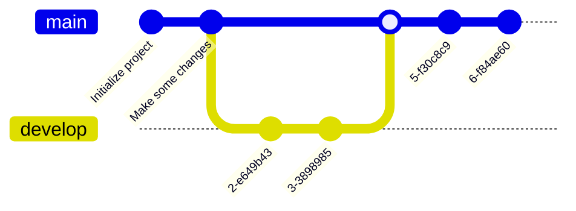

+++

title = "An Architecture and Prototype for Monitoring Distributed Simulations of Distributed Systems"
description = "DS-RT 2024"
outputs = ["Reveal"]
aliases = ["/conference/"]

+++

<!--
    Narrativa:
    INTRO
    - Simulazioni come strumento di testing, perché? 
    - Multiple simulazioni, vengono poi aggregate per ottenre un risultato
    - Problemi, ci vuole un fracco di tempo (mostra processo)
    OBJECTIVEczlc
    - Creare un architettura che permette di visionare aspetti di simulazioni a run time
    HOW TO DO THIS?
    - Monitorare simulazione distributie non è troppo diverso da monitorare un DS classico ma...
    - ci servono le seguenti cose - poter ottenere feedback realtime,
        che i messaggi siano piccoli, poter cambiare cosa osservare velocemente,
        poter monitorare più simulazioni e aggregare i dati
    - filter what to monitor
    ARCHITECTURE
    - Elements
    - How they interact
    - Aggregation... lot of methods in literature
    Prototype
    - Alchemist and GraphQL
    Evalutaion
    - Simulation example
    - DEMO
    - RESULTS
    Future Work

-->

# An Architecture and Prototype for Monitoring Distributed Simulations of Distributed Systems
## DS-RT 2024 - Urbino, Italy, 2024
### Angelo Filaseta - angelo.filaseta@unibo.it
### Danilo Pianini - danilo.pianini@unibo.it
### Angela Cortecchia - angela.cortecchia@unibo.it

---

# Simulations as Testing Tools

- Simulations allow to **validate** theories by comparing outcomes with expected or real-world behavior;
- Usually, **multiple simulations** are run to obtain a statistically significant result;
  - The results are usually **aggregated** using statistical methods (mean, median, etc.);

---

# It seems pretty straightforward, but...
###  Ever experienced a little déjà vu in your workflow?
{}{}

- In reality, this process is both **time-consuming** and **resource-intensive** <small>(and also quite tedious)</small>
- Even under the most favorable conditions,
the time needed to unify the results *is constrained by the slowest execution* among the runs.

- Moreover, we are not accounting for the potential occurrence of **anomalies**, which could not only prolong the time required for the process
  - but may also necessitate starting over entirely! <small>(😭)</small>

{}
{}

{}
{}


---

# Objective

- An **efficient** and **scalable** method for monitoring *multiple* distributed simulations in real-time is required.

- The objective is to provide **early feedback** about the behavior of the system under development.

- The system will still be validated using the traditional way, but *a lot of time can be saved* in the long run!<small>(🤩)</small>

---

# Architecture


{}
{}
### Key Components
-  **Target Distributed System (TDS)**:<br> the simulated element in which properties of interest are located;

-  **Network Node**:<br> the logical device hosting and executing one or more TDSs;

-  **Broker**:<br> provides an interface to interact with a TDS;
    - In this architecture, a broker interacts with only one TDS;
    - three types of interactions: _Query_, _Action_, and _Subscription_;
   
- **Monitor**:<br> interacts with multiple Brokers in order to retrieve data from the TDSs.

{}

{}

{}
{}

---

# A basic implementation

{}
{}

- The **Monitor** is a *Web Application*;
  - Thanks to the rich ecosystem of libraries available, data visualization can be effectively implemented;
  
- The **Broker** is a *GraphQL* Server;
  - The GraphQL schema is an ideal choice, providing great flexibility in query construction;
  - It allows to retrieve exactly (and only) the data we need, using the simulator's terminology for intuitive and efficient data access;
  
- Finally, the **TDS** is implemented using *Alchemist*;
  - Alchemist is a general purpose simulator wih a focus on pervasive, aggregate, and nature-inspired computing.

{}
{}

{}
{}

---

# Evaluation

{}{}
- A morphogenesis process is used as a case study for evaluation.
  - It implements an extended version of the *Vascular Morphogenesis Controller* algorithm in **Aggregate Computing**.
  
- **Nodes** are depicted as circles, while **communication channels** are represented by lines.
- The <strong style=" color:#006666">cyan</strong> and <strong style="color:#6B5000">yellow</strong> areas represent different kinds of resources, attracting the growth of the structure.
- The algorithm begins with a single node and will generate more according to the environmental conditions.
{}
{}

<div align="center">
Visual evolution of the simulation under observation
</div>
{}
{}

<small>Our reproducibility suite is available on GitHub :  [AngeloFilaseta/dsrt-2024-distributed-monitoring](https://github.com/AngeloFilaseta/dsrt-2024-distributed-monitoring) </small>

----

# Evaluation - Scalability

- A **Baseline Query** retrieve the whole state of the simulation , while the **Specific Query** retrieves a subset of data.

- The size of the response is checked for both queries as the number of nodes increase in the simulation.
    - In both approaches, the response size scale proportionally with the node count;
    - However, the **Specific Query** is more efficient, as it retrieves only the required data in *real-time*.


<small>Results reflect the aggregation of *10* simulations, each with a different seed.</small>

---

# Evaluation - Efficiency

- **Lost updates**:  a missed event that occurred between two consecutive query calls, in which the target measure changed one or more times, but it was not captured
- **Useless polling**: a query is executed without capturing new events since the last executed query.



<small>Results reflect the aggregation of *100* simulations, each with a different seed.</small>

---

# Evaluation - Viability

- It is possible to monitor the evolution of data of multiple distributed simulation in real-time.
- A very basic aggregation algorithm has also been implemented.
    - It helps in identifying the overall trends of all the simulations.

---

Autoresize specifying

* `max-w` (percent of parent element width) and/or `max-h` (percent of viewport height) as max sizes , and
* `width` and/or `height` as *exact* sizes (as percent of viewport size)



---

## Multi-column slide

{}{}
Column 1
{}{}
Column 2
{}{}

---

## Tick and Cross

* {} This is something good
* {} This is something bad

---

## Chart.js


{
    type: 'bar',
    data: {
        labels: ['Red', 'Blue', 'Yellow', 'Green', 'Purple', 'Orange'],
        datasets: [{
            label: 'Bar Chart',
            data: [12, 19, 18, 16, 13, 14],
            backgroundColor: [
                'rgba(255, 99, 132, 0.2)',
                'rgba(54, 162, 235, 0.2)',
                'rgba(255, 206, 86, 0.2)',
                'rgba(75, 192, 192, 0.2)',
                'rgba(153, 102, 255, 0.2)',
                'rgba(255, 159, 64, 0.2)'
            ],
            borderColor: [
                'rgba(255, 99, 132, 1)',
                'rgba(54, 162, 235, 1)',
                'rgba(255, 206, 86, 1)',
                'rgba(75, 192, 192, 1)',
                'rgba(153, 102, 255, 1)',
                'rgba(255, 159, 64, 1)'
            ],
            borderWidth: 1
        }]
    },
    options: {
        maintainAspectRatio: false,
        scales: {
            yAxes: [{
                ticks: {
                    beginAtZero: true
                }
            }]
        }
    }
}


---

## FontAwesome

<i class="fa-solid fa-mug-hot"></i>
<i class="fa-solid fa-lemon"></i>
<i class="fa-solid fa-flask"></i>
<i class="fa-solid fa-apple-whole"></i>
<i class="fa-solid fa-bacon"></i>
<i class="fa-solid fa-beer-mug-empty"></i>
<i class="fa-solid fa-pepper-hot"></i>

---

## Bootstrap 1

<div class="card w-100" >
  
  <div class="card-body">
    <h5 class="card-title">Card title</h5>
    <p class="card-text">Some quick example text to build on the card title and make up the bulk of the card's content.</p>
    <a href="#" class="btn btn-primary">Go somewhere</a>
  </div>
</div>

---

## Bootstrap 2

<button type="button" class="btn btn-primary">Primary</button>
<button type="button" class="btn btn-secondary">Secondary</button>
<button type="button" class="btn btn-success">Success</button>
<button type="button" class="btn btn-danger">Danger</button>
<button type="button" class="btn btn-warning">Warning</button>
<button type="button" class="btn btn-info">Info</button>
<button type="button" class="btn btn-light">Light</button>
<button type="button" class="btn btn-dark">Dark</button>

<button type="button" class="btn btn-link">Link</button>

---

## Low res, plain markdown


---

## Hi res, plain markdown


---



# Large images as background
## (May affect printing)

---




# Video background

---

# $$\LaTeX{}$$


Inline equations like $E=mc^2$

$$\frac{n!}{k!(n-k)!} = \binom{n}{k}$$

---

# Code snippets


```kotlin
val x = pippo
```

```go
package main

import "fmt"

func main() {
    fmt.Println("Hello world!")
}
```

---

# Tables

Colons can be used to align columns.

| Tables        | Are           | Cool  |
| ------------- |:-------------:| -----:|
| col 3 is      | right-aligned | $1600 |
| col 2 is      | centered      |   $12 |
| zebra stripes | are neat      |    $1 |

There must be at least 3 dashes separating each header cell.
The outer pipes (|) are optional, and you don't need to make the
raw Markdown line up prettily. You can also use inline Markdown.

---

# Quotes

> Multiple
> lines
> of
> a
> single
> quote
> get
> joined

> Very long one liners of Markdown text automatically get broken into a multiline quotation, which is then rendered in the slides.

---

# Fragments

* 
* 
* 

---

# Graphs via Gravizo


  digraph G {
    aize ="4,4";
    main [shape=box];
    main -> parse [weight=8];
    parse -> execute;
    main -> init [style=dotted];
    main -> cleanup;
    execute -> { make_string; printf}
    init -> make_string;
    edge [color=red];
    main -> printf [style=bold,label="100 times"];
    make_string [label="make a string"];
    node [shape=box,style=filled,color=".7 .3 1.0"];
    execute -> compare;
  }


---

# Graphs via mermaid.js


---


# Graphs via mermaid.js with options


---
# Graphs via mermaid.js 2


---

# Graphs via mermaid.js 3



---

# Keystrokes

<kbd>Ctrl</kbd> + <kbd>Alt</kbd> + <kbd>Del</kbd>

---

# QR code

{}

---

# Import shared slides

<!-- write-here "shared-slides/devops/devops-intro.md" -->
<!-- end-write -->
